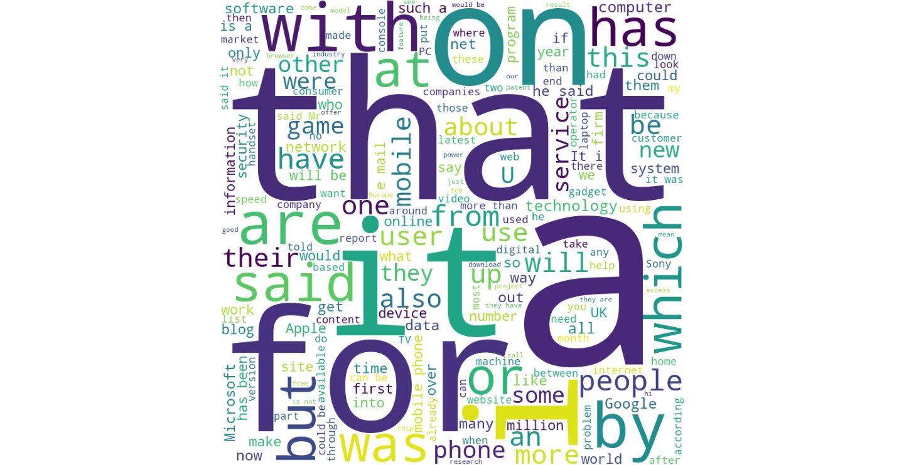
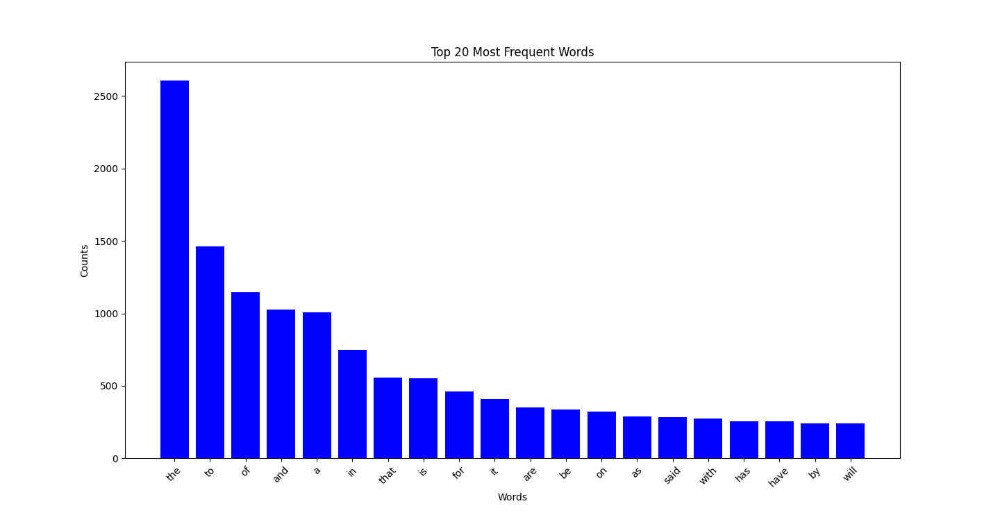

# text-visualization

Data set comes from Kaggle: https://www.kaggle.com/datasets/jensenbaxter/10dataset-text-document-classification

Commands to run this on MacOS

1. python3 -m venv env
2. source env/bin/activate
3. pip install wordcloud matplotlib
4. python3 run.py